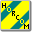
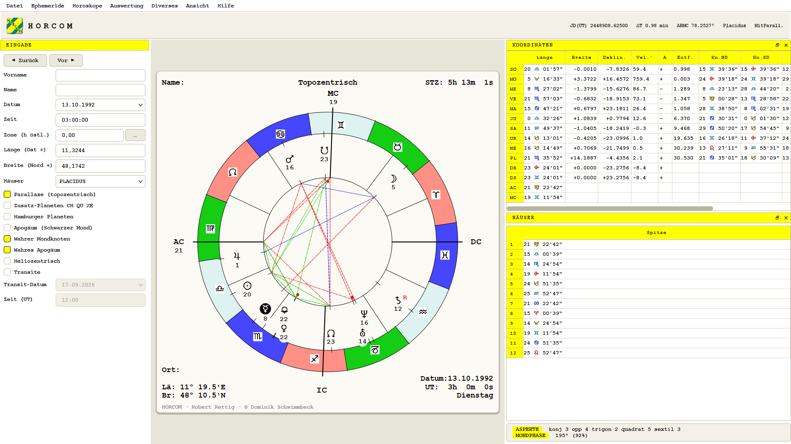

<p align="center">
  
</p>

<h1 align="center">horcom</h1>

A modern C++ rewrite of **HORCOM**, the astrology program that **Robert Rettig** wrote and refined over more than two decades, from about 1989 on the Atari ST until 2010 on Windows.

## About the original

HORCOM was Robert Rettig's life project. Written in GFA BASIC, it grew into a complete professional astrology suite that he distributed on CD and through his website. It computed and drew birth charts, transits, solar and lunar returns, composite and double charts, and a live clock chart. He did not stop at the standard planets. When no ephemerides existed for bodies he cared about, he computed his own, integrating the orbits of Chiron, Pholus, Nessus, Damokles, Quaoar, Eris and Halley's comet numerically and shipping the results as ephemeris files spanning centuries. The program carried interpretation texts, a statistics module, historical time zone tables for dozens of countries and a places database, all built and maintained by him.

He wished for HORCOM to live on in C++. This project is that rewrite, done carefully rather than quickly, staying faithful to his algorithms and keeping his own comments alive in the ported code.

<p align="center">
  
</p>

## Repository layout

| Path | Purpose |
|---|---|
| `src/` | The new C++ implementation |
| `apps/` | The `horcom` command line tool and the `horcom_gui` Qt desktop shell |
| `tests/` | Tests, including comparisons against the original program's results |
| `data/` | His ephemerides, term tables, place and zone catalogues |
| `docs/` | Architecture notes, the map of the original program, the rewrite plan and the handbook (`docs/handbook/index.html`) |
| `reference/` | Verified UTF-8 copies of his original GFA BASIC listings, the factual base of the port (local only, not in git) |
| `legacy/` | The complete original archive, programs, data and documents (local only, not in git, contains private data) |

## Principles

- The original program defines correct behavior. Where the rewrite deviates, the deviation is documented.
- Robert Rettig's own comments are carried over into the C++ code wherever they still apply, in his words.
- Personal data from the original archive (chart collections, customers, keys) never enters this repository.

## Status

The original program (50,397 lines, 1,095 procedures) is mapped end to end:

- `docs/legacy/calculation-core.md` — the astronomical engine (VSOP series, Moon theory, his integrated ephemerides, parallax, houses, aspects) with the porting order
- `docs/legacy/ui-and-graphics.md` — the full menu tree (the feature inventory), event loop and the exact chart geometry
- `docs/legacy/data-formats.md` — byte-level specifications of every file format
- `docs/legacy/tools-and-modules.md` — the ephemeris production chain (Runge-Kutta + Störmer integration) and the survey of all standalone tools
- `docs/architecture.md` — the target C++ design, verification strategy and phase plan

The port advances routine by routine, every step verified against Meeus's worked examples, his binary data files and independent cross computations. Ported and green so far:

- the calculation kernel, calendar, delta T and sidereal time
- the position engines, VSOP series, Moon theory, Kepler orbits, his self integrated ephemeris files, nutation, precession and the Chapront Pluto fallback
- the chart pipeline, all seven house systems, the correction chain with his protected topocentric parallax, lunar nodes, Black Moon and the Part of Fortune
- the harmonic aspect scanner with his orb system, the Schiemenz counters, the midpoints and the two chart comparison scan
- his exact hit search with solar and lunar returns, sign ingresses and the transit event sweep, verified against the almanac's 1993 equinox to within two minutes
- the wheel renderer with his exact geometry, SVG export and the `horcom` command line tool
- his file formats byte for byte, chart collections, places, the zone and country tables, the KONSTA settings stream and the AAF exchange format

The Qt 6 desktop shell carries his visual identity and starts on his own settings profile, the topocentric parallax on just as he ran it. It already covers the heart of his menu tree, place search over his gazetteer with the historic zone catalogue, transits on his double wheel with the running sky outside the signs, the transit event list, solar and lunar returns, sign ingresses, chart comparison, a record mask writing real AAF collections, and the running UHR clock chart. It speaks German natively, his language, and English through a bundled translation. Ahead lie golden fixtures recorded from the original program, composite charts, directions and his statistics module.

```
build\apps\horcom.exe --date 13.10.1992 --time 03:00 --lon 11.32 --lat 48.17 --extras --svg wheel.svg
```

## Building

A C++20 compiler (MSVC 2022 on Windows) and CMake 3.25 or newer build the library, the command line tool and the tests. Qt 6 with Widgets, Svg and the Linguist tools additionally builds the desktop shell, the target is skipped where Qt is absent.

```
cmake -S . -B build -DCMAKE_PREFIX_PATH=C:/Qt/6.8.3/msvc2022_64
cmake --build build --config Release
ctest --test-dir build -C Release
```

The programs expect the `data` folder next to the executable or above it. The project lives at [github.com/horcom-rr/HORCOM](https://github.com/horcom-rr/HORCOM). Every push builds and tests there and publishes a fresh [Windows release](https://github.com/horcom-rr/HORCOM/releases/latest), versioned 0.x until the port of the original is complete, so a ready build is always one download away.

## License

GPL-3.0-or-later, see `LICENSE`. The rewrite stays open, every derivative stays open, and Robert Rettig's name stays attached to his work. Maintained by Dominik Schwimmbeck.

---

<p align="center"><i>In loving memory Ingrid &amp; Robert Rettig ❤️</i></p>
