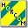
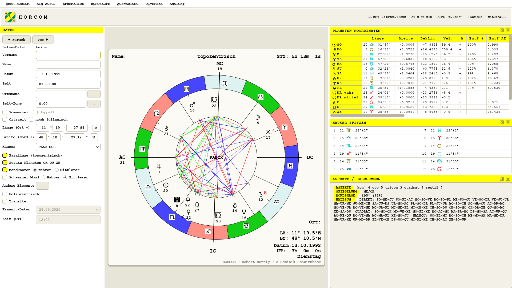

<p align="center">
  
</p>

<h1 align="center">horcom</h1>

<p align="center">
  <a href="https://github.com/horcom-rr/HORCOM/actions/workflows/build.yml"></a>
  <a href="https://github.com/horcom-rr/HORCOM/releases/latest"></a>
  <a href="https://github.com/horcom-rr/HORCOM/releases"></a>
  <a href="https://horcom-rr.github.io/HORCOM/"></a>
  <a href="LICENSE"></a>
  
  
  
</p>

A modern C++ rewrite of **HORCOM**, the astrology program that **Robert Rettig** wrote and refined over more than two decades, from about 1989 on the Atari ST until 2010 on Windows.

## About the original

HORCOM was Robert Rettig's life project. Written in GFA BASIC, it grew into a complete professional astrology suite that he distributed on CD and through his website. It computed and drew birth charts, transits, solar and lunar returns, composite and double charts, and a live clock chart. He did not stop at the standard planets. When no ephemerides existed for bodies he cared about, he computed his own, integrating the orbits of Chiron, Pholus, Nessus, Damokles, Quaoar, Eris and Halley's comet numerically and shipping the results as ephemeris files spanning centuries. The program carried interpretation texts, a statistics module, historical time zone tables for dozens of countries and a places database, all built and maintained by him.

He wished for HORCOM to live on in C++. This project is that rewrite, done carefully rather than quickly, staying faithful to his algorithms and keeping his own comments alive in the ported code.

<p align="center">
  
</p>

## Repository layout

| Path | Purpose |
|---|---|
| `src/` | The new C++ implementation |
| `apps/` | The `horcom` command line tool and the `horcom_gui` Qt desktop shell |
| `tests/` | Tests, including comparisons against the original program's results |
| `data/` | His ephemerides, term tables, place and zone catalogues, and his original commentary texts (`data/kommen/`) |
| `packaging/` | Linux desktop entry, AppStream metadata and the AppImage build script |
| `docs/` | Architecture notes, the map of the original program, the rewrite plan and the handbook (`docs/handbook/index.html`) |
| `reference/` | Verified UTF-8 copies of his original GFA BASIC listings, the factual base of the port (local only, not in git) |
| `legacy/` | The complete original archive, programs, data and documents (local only, not in git, contains private data) |

## Principles

- The original program defines correct behavior. Where the rewrite deviates, the deviation is documented.
- Robert Rettig's own comments are carried over into the C++ code wherever they still apply, in his words.
- Personal data from the original archive (chart collections, customers, keys) never enters this repository.

## What it does

HORCOM keeps the menus, dialogs, screens and calculations of Robert Rettig's program, on today's Windows and Linux desktops.

- **Charts:** birth charts with seven house systems, his topocentric parallax, true or mean lunar node and Black Moon, Chiron, Quaoar, Eris (Xena), the asteroids and the Hamburg points, heliocentric and mundane views.
- **Tables:** planet coordinates with both distances, fixed stars, Arabic parts, sign ingresses of every planet and of MC and AC, eclipses, rise and set times, the great (Platonic) year.
- **Returns and directions:** solar, lunar, planetar and personar returns, the Munich rhythm theory with its septars, secondary and arc directions, primary and symbolic directions, multiple directions and harmonics, transits and mundane aspects, linear graphs and the dynamogram.
- **Comparisons:** composite, combine, double wheel and the 90 degree dial.
- **Records:** his data files and AAF exchange files, his place and time zone catalogues, the statistics module over whole collections.
- **Output:** printing, PDF, SVG and PNG export, and his commentary texts under every menu.
- **Comfort:** side panels for coordinates, house cusps and aspects, adjustable text size, black on white or a night sky dress, German and English.

The [handbook](https://horcom-rr.github.io/HORCOM/) walks through the program in its [tutorial](https://horcom-rr.github.io/HORCOM/tutorial.html).

## Status

Every program of the original menu tree has been ported and checked against the original. Releases carry 0.x version numbers until the 1.0 release.

The `horcom` command line tool computes a chart without the desktop shell:

```
build\apps\horcom.exe --date 13.10.1992 --time 03:00 --lon 11.32 --lat 48.17 --extras --svg wheel.svg
```

## For developers

- `docs/architecture.md` explains the C++ design, the verification strategy, every deliberate deviation from the original and every bug of the original that was fixed.
- `docs/legacy/` maps the original program (50,397 lines, 1,095 procedures): the astronomical engine, the menu tree and screen geometry, the file formats and the ephemeris production chain. `docs/coverage.md` accounts for every procedure by name.
- The tests compare against Meeus's worked examples, his binary data files, independent cross computations and output recorded from the original program.

## Installation

Every push builds and tests the program on Windows and Linux and publishes a [release](https://github.com/horcom-rr/HORCOM/releases/latest), versioned 0.x until 1.0, so a ready build is always one download away. The [handbook](https://horcom-rr.github.io/HORCOM/install.html) has the full installation guide.

### Windows

1. Download `horcom-windows-x64.zip` from the [latest release](https://github.com/horcom-rr/HORCOM/releases/latest).
2. Unpack it into a folder of your choice, for example `Documents\HORCOM`.
3. Start `horcom_gui.exe`. The `data` folder must stay beside it, your settings and data files are written there.

To update, unpack a newer release over the old folder, your own files are kept. To uninstall, delete the folder.

Windows may warn about an unknown publisher when starting a downloaded `horcom_gui.exe`. That is expected for a young open source program without a paid code signing certificate, not a finding about the software. Click **More info**, then **Run anyway**. Every release ships a `SHA256SUMS.txt`, so a download can be verified against the hash published by the build pipeline, `Get-FileHash horcom-windows-x64.zip` in PowerShell prints the value to compare. The releases will be signed once the project has grown into it.

### Linux

The AppImage runs on any 64 bit desktop with glibc 2.35 or newer (Ubuntu 22.04, Debian 12, Fedora, Arch, openSUSE and relatives). It is one self contained file with Qt inside, nothing is installed into the system.

```sh
chmod +x horcom-linux-x86_64.AppImage
./horcom-linux-x86_64.AppImage
```

- Verify the download with `sha256sum -c SHA256SUMS.txt --ignore-missing`.
- If it does not start and mentions FUSE, install `libfuse2t64` (Ubuntu 24.04), `libfuse2` (Ubuntu 22.04, Debian) or `fuse-libs` (Fedora), or start it with `--appimage-extract-and-run`.
- [Gear Lever](https://github.com/mijorus/gearlever) or AppImageLauncher add it to the application menu and keep it updated, each release ships a `.zsync` file for delta updates.
- Your settings live in `~/.config/horcom/horcom.conf`, your working files (KONSTA settings, SPEZIAL data files, own places) in `~/.local/share/horcom/data`. Updating means replacing the AppImage, your files stay.

## Building from source

A C++20 compiler and CMake 3.25 or newer build the library, the `horcom` command line tool and the tests. Qt 6 with Widgets, Svg, PrintSupport and the Linguist tools additionally builds the desktop shell, the target is skipped where Qt is absent. Warnings are errors on every compiler.

**Windows** (MSVC 2022, Qt 6.8 for MSVC). `build.bat` configures, builds and tests in one go, or by hand:

```
cmake -S . -B build -G Ninja -DCMAKE_BUILD_TYPE=Release -DCMAKE_PREFIX_PATH=C:/Qt/6.8.3/msvc2022_64
cmake --build build
ctest --test-dir build --output-on-failure
```

**Linux** (GCC 12+ or Clang 18+, the distribution's Qt 6). Install the dependencies, then run `./build.sh` from the repository root, which configures, builds and tests. `QT_PREFIX=~/Qt/6.8.3/gcc_64 ./build.sh` uses a Qt outside the system.

| Distribution | Dependencies |
|---|---|
| Ubuntu 24.04, Debian 12 | `sudo apt install build-essential cmake ninja-build libgl-dev qt6-base-dev qt6-svg-dev qt6-tools-dev qt6-tools-dev-tools qt6-l10n-tools` |
| Fedora | `sudo dnf install gcc-c++ cmake ninja-build qt6-qtbase-devel qt6-qtsvg-devel qt6-qttools-devel` |
| Arch | `sudo pacman -S base-devel cmake ninja qt6-base qt6-svg qt6-tools` |

The built programs find the `data` folder of the checkout by themselves. `sudo cmake --install build` installs system wide in the usual layout (binaries in `bin`, data in `share/horcom/data`, desktop entry, AppStream metadata and icons), `packaging/linux/appimage.sh` builds the release AppImage. MSVC, GCC and Clang produce byte identical chart output.

## License

GPL-3.0-or-later, see `LICENSE`. The rewrite stays open, every derivative stays open, and Robert Rettig's name stays attached to his work. Rewritten in C++ and maintained by Dominik Schwimmbeck.

---

<p align="center">Thanks to Robert's close friend André, who made this possible.</p>

<p align="center"><i>In loving memory of Ingrid &amp; Robert Rettig ❤️</i></p>
